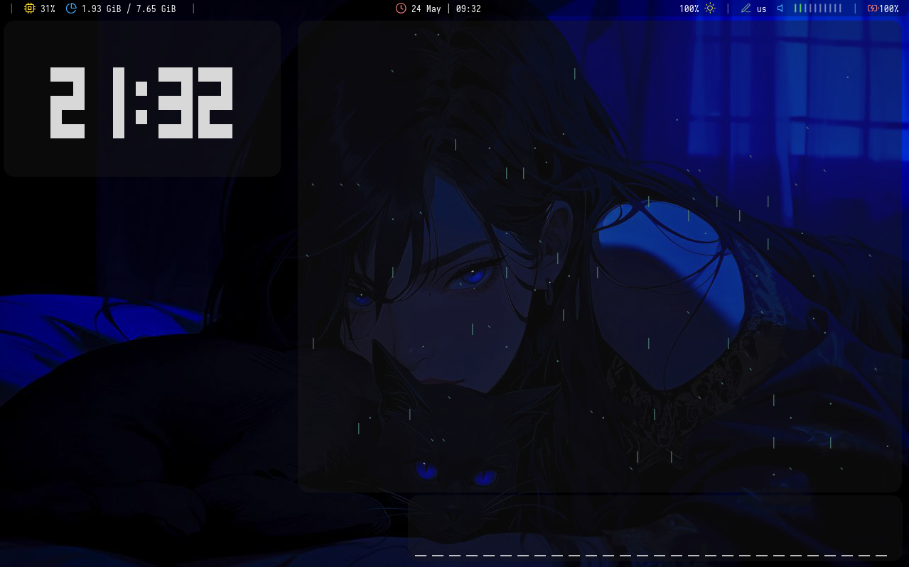
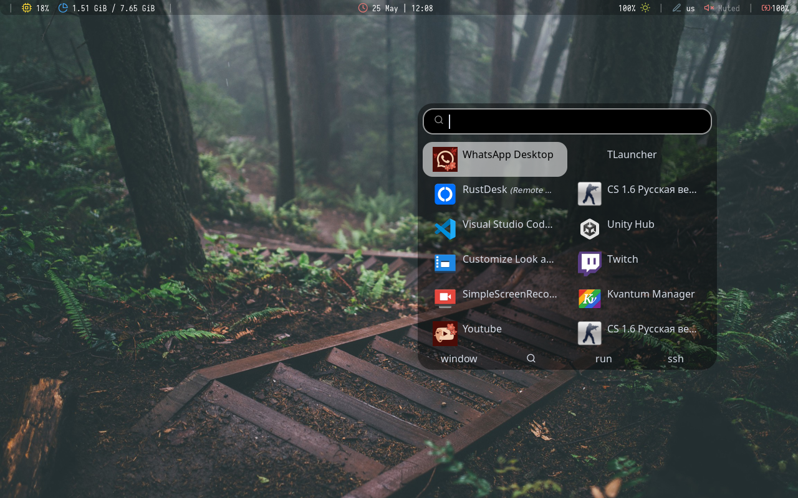
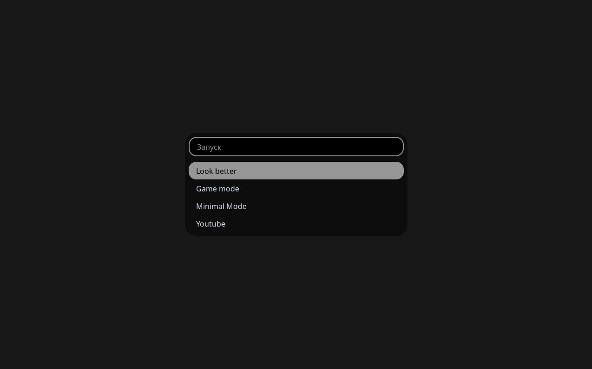

#  bspwm-rice

Minimal and lightweight BSPWM setup for Arch Linux.

> old hardware friendly • animations optimized

---

## Preview

  
  

  

https://github.com/user-attachments/assets/

---

## Features

- optimized for older and weaker devices
- lightweight setup

---

## Installation

Full installation guide:

➡️ [INSTALL.md](./INSTALL.md)

---

## Notes

This instruction is suitable for users who have basic command skills in the terminal, mainly disk management and partitioning.

- designed for Arch Linux
- optimized for low-end hardware
- minimal memory usage

# I have an old Lenovo ThinkPad X200s laptop. It has the following specs:
 - Processor: Core 2 Duo P8400
 - Video chip: Intel GMA 4500MHD
 - RAM: 8GB (used to have 4, but I added 4 more)

And on such an old laptop, the system just flies, animations are smooth, applications launch quickly
